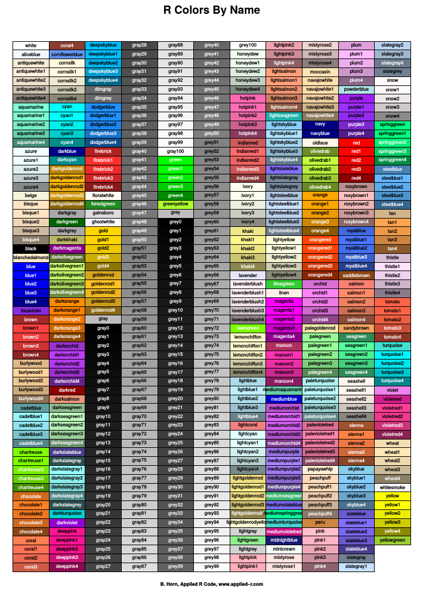

# Introduction

One of the most critical steps in data science -- one I'll confess I often overlook in my rush to look at treatment differences -- is to inspect the distribution of data. This allows us to confirm whether the distribution follows a bell shape, and also to identify extreme values that should be further investigated. There are a multiple ways to do this. This week, we will focus on the histogram.

# Case Study

The first example we will use is a cotton uniformity trial conducted in Greece in 1938. Yes, it is a bit dated, but the data are open-source and the concept is one we deal with every day in agricultural research: how consistent are our plots? In other words, what is the variance among plots?

In a uniformity trial, a several plots are managed identically so that the distribution of their yields can be measured. These data can be used to determine whether that field is a good site for a research trial, or how data might vary n a similar field.

Our first step is to load the data, which is in a .csv file. To do this, we will use the `read.csv` function.

```{r}
cotton = read.csv("data/cotton_uniformity.csv")
```

# Basic Histogram

Drawing a simple histogram in R requires two steps:

1.  Define the column in which we are interested.

2.  Create the histogram.

Since we are using a data.frame, we need to tell R which column to plot. We will first extract the data from the data.frame We will call this column "yield". To extract the yield column from our data.frame, we reference the column of the data.frame as `cotton$yield`. To the left of the dollar sign (\$) is the name of the data.frame, *cotton*. To the right of the dollar sign is the name of the column, *yield*.

```{r}
yield = cotton$yield

```

We then can create the histogram using the `hist()` function. We will assign the output to another R object, *histogram*. As we will see, that object contains much more information than just our histogram plot.

In the following line, we tell R to plot the histogram, using the `plot()` function.

```{r}
histogram = hist(yield)
plot(histogram)
```

And, *voila*!, we have our histogram. Each bar represents a range in values called a **bin**.

If we view the histogram object itself, however, we will see it is composed of many different statistics. histogram is a kind of R object called a **list**. It is a collection of many data frames.

```{r}
histogram
```

Each of these objects can be viewed separately, using the dollar sign method we used above.

For example, we can see the upper and lower yield limits of each bins by running `histogram$breaks`.

```{r}
histogram$breaks
```

Alternatively, we could see the midpoints, or yield values that define the middle of each bin by running `histogram$mids` as a command.

```{r}
histogram$mids
```

As we saw in the lesson, varying the number of columns can affect how we see patterns in the data. In the plot above, we have 14 bars. Each bar represents a bin width of 0.1. What if we tell R to use 28 bins to draw the histogram? We can do that by adding the argument `breaks=28` to our `hist()` function.

```{r}
histogram = hist(yield, breaks = 28)
plot(histogram)

```

Note that we ended up with 27, not 28 bins, This is because it takes 28 breaks to define 27 bins. You can count the breaks, or sides of the bars in the histogram, to prove this to yourself. Each bar now has a bin width that is 0.05 kg. We can verify this by again inspecting the data by running `histogram$breaks`.

```{r}
histogram$breaks
```

# Histograms with ggplot

One of the great features of R is that there are hundreds of **packages** that can be added to it. These are like add-ins that you make have used with *Word* or *Excel*. Packages, like R, are open source, and are composed of specialized functions for many, many areas of research: agronomy, spatial data, ecology, medicine, machine learning, working with online databases like *SSURGO,* and so forth.

`ggplot2` is a one very powerful and population package in R, used to creating highly-customized plots. I use `ggplot2` to create a most of the plots I use in industry. if you can envision a plot, you almost certainly can draw it using `ggplot2`, .

There are entire books written on `ggplot2` (here is one I have consult regularly: <https://r-graphics.org/index.html>). I don't have time to teach it to you in depth, but I will show you many basics in this course.

The first time we want to use a package in R, we need to install it using the `install.packages()` function. While I try to install all packages you need for this course in *RStudio Cloud*, if you download *RStudio* to your desktop, you will need to install packages yourself. To install `ggplot2`, we run the following command:

```{r}
install.packages("ggplot2")

```

Note: you only need to install a package the very first time you use it. We can now start the package using the `library()` function.

```{r}
library(ggplot2)
```

You only need to load a package once per R session. But if you restart R on your desktop, or log out and back into *RStudio Cloud*, you may need to reload the packages you intend to use. I make it a point to load the package in each notebook, rather than assuming it is loaded from another notebook I was working on at the same time.

The first line of code calls `ggplot()`. Although the package is called `ggplot2`, the function we use is `ggplot`**.** Confusing, I know.We use `data=cotton` to tell R we are drawing data from the "cotton" data frame.

```{r}
ggplot(data=cotton)
```

Running that first like alone will give us a blank plot. This is because we need to specify one or more aesthetics for each plot. An **aesthetic** is any property of the plot that relates to a variable, that is, a column in our data frame. In this case, we use aes(x=yield) to tell R that our aesthetic is positioned horizontally according to the value of yield.

Notice the *x-axis* now contains the range of yield values in our dataset. But there are no bars yet. We need to tell R what shape to use to represent the values of yield.

In the second line, we use `geom_histogram` to tell R we are drawing a histogram. Knowing this, R will automatically assign bins and count the number of observations in each bin.

```{r}

ggplot(data=cotton, aes(x=yield)) +
  geom_histogram()
```

By default, R chooses to create 30 bins. We can easily specify a different number of bins adding the `bins=15` argument to the `geom_histogram()` function.

```{r}
ggplot(data=cotton, aes(x=yield)) +
  geom_histogram(bins=15)
```

Alternatively, we can set a particular binwidth using the `binwidth =0.05` argument.

```{r}
ggplot(data=cotton, aes(x=yield)) +
  geom_histogram(binwidth=0.05)
```

If we want to make our plot a little less bland, we can tell ggplot to use a different color to fill the bars by adding the `fill = darkolivegreen` argument.

```{r}
ggplot(data=cotton, aes(x=yield)) +
  geom_histogram(binwidth=0.05, fill="darkolivegreen")
```

Finally, we can outline the bars using the `color ="black"` argument.

```{r}
ggplot(data=cotton, aes(x=yield)) +
  geom_histogram(binwidth=0.05, fill="darkolivegreen", color="black")
```

We will introduce more ways to fine tune our plots as the course goes on. Here is a table with named colors you can use for fill or lines. (Note: If you right-click on it and select *Open in new tab*, you can enlarge it for much better legibility



# Practice

In the data folder there are three practice files: barley_uniformity.csv, peanut_uniformity.csv, and tomato_uniformity.csv. Practice creating histograms using both the basic and ggplot methods. To start you off, here is the command to load the barley file.

```{r}
barley = read.csv("data/barley_uniformity.csv")
```

Remember to use CTRL+ALT+I to insert new code chunks below.
