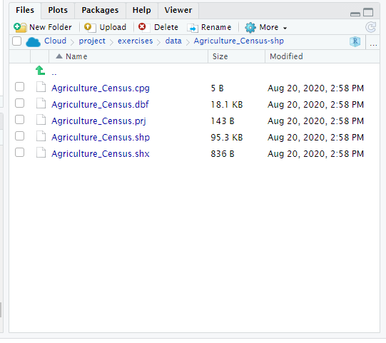

# Introduction

One of my more recent areas of growth as a data scientist has been learning to work with spatial data. If you have worked with yield monitor data, *ArcGIS*, or used an application map to vary the application rate of your fertilizer, you have worked with spatial data. We will learn how to plot spatial data in detail in Unit 12, but here is a brief introduction to importing and inspecting spatial data.

# R Packages

To look at spatial data, we will use the R package `sf` (short for *spatial features*). Remember, when we use a new package in R for the first time, we must install and launch it with the following commands. The `sf` package takes a while to install, so it is already installed in *RStudio Cloud*. As a reminder, however, the installation code is included below. In this case it has a hashtag (\#) in front of it. The hashtag converts code to a **comment**; any code that follows a hashtag on the same line will not be run. This is a useful way to block code we don't want to run, or add an explanation about code we are running

Go ahead and restart R and clear the output, as you learned in the *summary statistics* exercise, then install and load the `sf` package with the code below:

```{r}
# install.packages('sf')
library(sf) # this loads the sf package
```

# Reading Shapefiles

To read in a shape file, we use the `st_read()` function. We read in a shape file the same way we read in a .csv file in the previous exercise. We follow `st_read()` with the path to the shape file, which has a .shp suffix.

If you view a shape file in the file directory, it is usually accompanied by identically named files with different extensions (the three letters after the last period). For example, if you navigate to the directory *Cloud\>project\>exercises\>data\>Agriculture_Census-shp* in the window in the lower right, you will see the *Agriculture_Census.shp file, but also Agriculture_Census.prj* and three other files. These additional files tell R how to draw the shapefile as a map. Reading in the shape file (*Agriculture_Census.shp*) will cause these other files to be read in automatically.



We will read in a shape file from Indiana that includes county summaries for a couple of dozen agricultural statistics.

```{r}
indiana = st_read("data/Agriculture_Census-shp/Agriculture_Census.shp")
```

# Examining Spatial Feature Data Frames

Let's inspect the first six rows of the spatial feature data frame using the `head()` command, where the name of the data frame is given between the parentheses.

```{r}
head(indiana)
```

Spatial feature data frames are very similar to the data frames that were introduced to in the last exercise. There are a few differences, however. First, every spatial feature data frame consists of rows of observations that are linked, in the geometry column, with a georeference. That georeference may be a simple point on the map, or it may be a polygon that defines an area, such as a field, a county, or a state.

Spatial feature data frames also include some metadata about the geometry of the file, including geometry type (POLYGON in this case, since we are working with county outlines) and -- this is critical -- *CRS*. CRS stands for **coordinate reference system**, the "projection" we use to draw a map, and the georeferences used to define a place or area.

Maps are flat representations of a round object, and there are different ways to draw these maps. We need not go into a deep review of those projects at this point; suffice it to know that each projection represents tradeoffs in how accurately it portrays areas in the center and periphery of the map and how much it represents the curvature. For most of my work, I use the CRS of 4326. You know this system more commonly as the latitude/longitude system.

The bounding box defines where the map is centered. Latitude/longitude maps are more accurate in portraying areas near the center of the map than the periphery, so it is important the map be centered on the area of interest.

Don't worry about committing the above information to memory for now, we will discuss projection is much greater detail in Unit 12.

# Visualizing Data

To visualize the data, we can use the `plot()` function from the sf package. You might assume we could map a column of data the same way we visualized its contents earlier, by indicating the data frame and column name, separated by the dollar sign. We will try that with TOTCROP_AC, the total number of acres per county in crop production.

```{r}
tot_crop = indiana$TOTCROP_AC


plot(tot_crop)
```

Instead of a map, however, this shows us the range of values for TOTCROP_AC in the dataset.

To view a map, we need to first subset the data a little differently than we did before: we can't use the dollar-sign approach. That only assigns the values of our single column to our new R object.

See what happens if we look at the top of our tot_crop object using the `head()` command

```{r}
head(tot_crop)
```

The object only has a single column of numbers with the county values. It lacks information on the geometry of those counties, so that they can be drawn.

To draw our map, we need to assign two columns to our new object: TOTCROP_AC and geometry columns. We do this by referencing the desired measure as `indiana["TOTCROP_AC"]`. This tells R to pass both the TOTCROP_AC values and their geometries to the new object, `tot_crop`.

```{r}
tot_crop = indiana["TOTCROP_AC"]
head(tot_crop)

```

When we examine the top six rows of our object, tot_crop, we see it contains both the county values and the county geometries.

Note: we only use this approach, with the desired data column in quotes and brackets, with shape file data. The rest of the time, the data frame and desired column should be separated by the dollar sign, as we learned above.

We can then map these data:

```{r}
plot(tot_crop)
```

No one can resist a pretty map. The technical name for a map where political shapes like counties are color-code , is *chloropleth*. We saw plenty of these in 2020, between the pandemic and the election year.

Back to happier thoughts. Let's look at the mean farm income per county. This is indicated by the "DOL_FARM" column. Again, we first subset the data and then plot it.

```{r}

farm_income = indiana["DOL_FARM"]
plot(farm_income)
```

It looks like the larger farms, by income, are in northwest Indiana, just south of Lake County and the Chicago suburbs. Where are the chickens in Indiana? Let's find out:

```{r}
chickens = indiana["N_CHICKENS"]
plot(chickens)

```

It would appear the most finger-lickin' good county is Elkart County, in the far north. Think of it as a big "cluck you" to Michigan, which is immediately north of those counties. Appropriately, there are also a couple of counties near Kentucky!

# Create Your Own Maps

Where are the hogs in Indiana? Create a map for "N_PIGS".

```{r}
chickens = indiana["N_CHICKENS"]
plot(chickens)

```

Where are most of the wheat acres? Create a map for "WHEAT_AC".

Which counties have greater farm ownership by minorities? Create a map for "MINORTY_OP" (note the missing "I").
