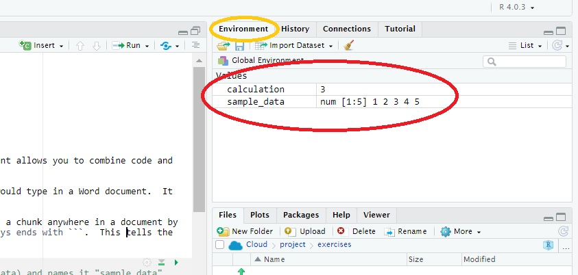

# Introduction

This document you have just opened is called an **R Notebook**. This document allows you to combine code and commentary into a seamless document.

This sentence is an example of commentary. **Commentary** is anything you would type in a Word document. It can be the identifier for a question, or your response to that question.

Immediately below is what in R Studio is called a **chunk**. You can create a chunk anywhere in a document by typing CTRL+ALT+I. Note that a chunk always begins with **\`\`\`{r}** and always ends with **\`\`\`**. This tells the notebook that anything between those two markings is R code to be run.

```{r}
sample_data = c(1,2,3,4,5) # this creates a vector (a single column of data) and names it "sample_data"

calculation = mean(sample_data) # this calculates the mean for the vector and names it "calculation"

calculation # this tells R to print the value of calculation
```

The code chunk above can be run by clicking on the green arrow in its upper-right corner. R will run and, if there are no errors, R will display the output of the code immediately *below* the chunk. If you click on the chunk above, it will create the `sample_data` vector, calculate the mean of that vector and name it "calculation", then print the result of calculation, which is 3. If you look in the panel to the right and up a little, you will see these two objects under the "Environment" tab.



There is nothing magical about the names we have selected. They are just placeholders for the data.

# Your Very First Code

Now you try it:

1.  Create a chunk by pressing CTRL+ALT+I.

2.  Create a vector named `my sample data` that contains the numbers 6, 7, 8, 9, and 10.

3.  Calculate the mean and assign it to a variable named `my_calculation`.

4.  Display the results.

Were you successful? You should see both the `my_sample_data` vector and `my_calculation` in the Environment to the right. You should also see the value of `my_calculation`, 8.

# Reading and Working with Data Frames

Of course, you will soon want to work with your own data, and it is likely to consist of multiple vectors (columns). That is, you have a table of data. In R, this is commonly referred to as a *data frame*. in R, it is labelled as a *data.frame.* Think of it as a spreadsheet. In fact, we will read an Excel spreadsheet below to create our data frame.

To read in any data frame, use the `read.csv` command. In the chunk below, we will use `read.csv` to read in a .csv file and assign it to a data frame named `yield`.

```{r}
yield = read.csv("data/sample_dataset_1.csv")
```

The text in quotes is the path to the table of interest. `data/` tells R the file is in a directory named *data* that is in the same folder as this file. The rest of the text is simply the file name.

We can view this data frame in two ways. We can simply type its name:

```{r}
yield
```

Or we can view it in more of a spreadsheet environment by double-clicking on it in the window to the right, or by typing `view(yield)` in the console window below.

Once the data frame is created, we can use it in any subsequent chunk. We can look at the data frame as a whole by typing its name. We can use a particular column by typing the name of the data frame, followed by `$` and the name of the column.

```{r}
single_column = yield$yield
single_column
```

If you pause after typing `$`, R will display a list of the available columns. Just click on the one in which you are interested.

# Basic Operations on Columns

We can easily perform statistical summaries now that we have defined `single_column`. As above, we can calculate it's `mean`:

```{r}
single_column_mean = mean(single_column)
single_column_mean
```

Or its `median`:

```{r}
single_column_median = median(single_column)
single_column_median

```

We can use the `max` function to calculate its maximum value:

```{r}
single_column_max = max(single_column)
single_column_max
```

And the `min` function for its minimum value:

```{r}
single_column_min = min(single_column)
single_column_min
```

# Knitting Your Results into a Document

When you are done creating your R notebook, you can knit it into a final document by clicking on the "Preview" button in the menu bar above:

```{r}
library(knitr)
include_graphics("images/knitting.png")

```

If you look in the exercise folder, you will find an .html printout of this notebook. You can email this file to collaborators, publish it to the internet, or incorporate it into your creative component.

# Practice

Now you try. There are four practice sets, labelled *intro_to_r\_practice_set_1.csv* through *intro_to_r\_practice_set_4.csv*. Practice reading in the .csv file and calculating summary statistics as shown above. Remember you can create a new chunk by pressing CTRL+ALT+I.
