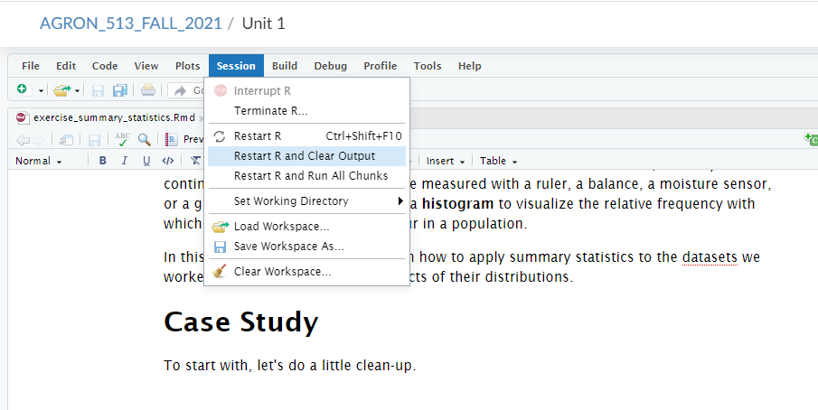

# Introduction

So far, we have learned two ways to visualize population data. First, if it is spatial data, we can draw a **map** that shows where each individual was measured. Second, with any continuous data (e.g. data that can be measured with a ruler, a balance, a moisture sensor, or a graduated cylinder), we can use a **histogram** to visualize the relative frequency with which different ranges of values occur in a population.

In this exercise, we are going to learn how to apply summary statistics to the datasets we worked with earlier to, quantify aspects of their distributions.

# Case Study

To start with, let's do a little clean-up. It is a good habit to clean out R and your environment of R objects (data.frames, lists, vectors, etc.) when you switch notebooks. Otherwise, you might accidentally use one of those objects in your new notebook, especially if you are prone to giving objects similar names (e.g,. "data") across R notebooks.

Click on the *Session* in the main menu bar (the one with File, Edit, etc) above. Then click on *Restart R and Clear Output*.



For this example, let's return to the cotton dataset from the *histograms* exercise. Again, we will read in these data using the `read.csv()` function`.`

```{r}
cotton = read.csv("data/cotton_uniformity.csv")
```

The cotton was grown in 1024 plots and sampled for biomass. We can create a map of sorts for this data with ggplot. We will not dwell on the particulars of code for this plot -- the important thing is the plot map itself.

```{r}
library(ggplot2)

ggplot(cotton, aes(x=col, y=row, fill=yield)) +
  geom_tile() +
  scale_fill_gradientn(colors=terrain.colors(5))

```

# Percentile, Mean, Median, Maximum, and Minimum

In addition to histograms, we can use percentiles and other statistics to describe our data more numerically. To identify percentiles, data are numerically ordered (ranked) from lowest to highest. Each percentile is associated with a single value from our data; the percentile is the percentage of all data equal to or less than that value.

We can quickly generate the 0th, 25th, 50th, and 75th, and 100th percentile for our yield data column using the `summary()` function.

```{r, percentile_summary}
yield = cotton$yield
summary(yield)

```

This returns six numbers. The 0th percentile (the **minimum** or "min") is 0.36 -- this is the lowest yield measured in the field. The 25th percentile (the **1st Quartile**) is 0.8375. This means that 25% of all observations were 0.8375 or less. The 50th percentile (the **median**) was 1.03, meaning half of all observed values were 1.03 or less. 75% of observations were less than 1.17, the 75th percentile (the **3rd quartile**). Finally, the 100th percentile (the **maximum**) recorded for this field was 1.66.

We can also directly calculate statistics using the `mean()`, `median()`, `max()`, and `min()` functions.

```{r}
mean(yield) # mean yield
median(yield) # median yield
max(yield) # maximum yield
min(yield) # minimum yield
```

# Variance and Standard Deviation

It is also simple to calculate variance and standard deviation in R, using the `var()` and `sd()` functions.

```{r}
var(yield) # variance
sd(yield)
```

# Sum of Squares

While it is rare that we summarize a population with the sum of squares, on occasion we may want to calculate it. R does not have a direct function to calculate the sum of squares, but we can calculate it using the variance and number of observations.

In the lecture portion of this unit, we learned the relation ship between variance and sum of squares was as follows:

$$\sigma^2 = \frac{S_{xx}}{n}$$

Where $\sigma^2$ is the variance, $Sxx$ is the sum of squares, and $n$ is the number of individuals in the population. If we rearrange this equation, we can see that the sum of squares is the product of the variance and n.

$$S_{xx} = \sigma^2 \cdot n$$

We calculated our variance above using `var()`. We can count the number of individuals in the population using the `length()` function. By multiplying these two statistics together, we can calculate the sum of squares.

```{r}
variance = var(yield) # calculate the variance
N = length(yield) # cound the number of observations in the yield column

sum_squares = variance*N # multiply variance by N to get sum of squares
sum_squares
```

In the above code, we assigned the population variance to a the variable *variance*. We assigned the population size to the variable *N*. Finally, we multiplied these two new variables to calculate *sum_squares*, the sum of squares.

# Practice

Practice calculating the summary statistics for the barley_uniformity.csv, peanut_uniformity, and tomato uniformity datasets.
