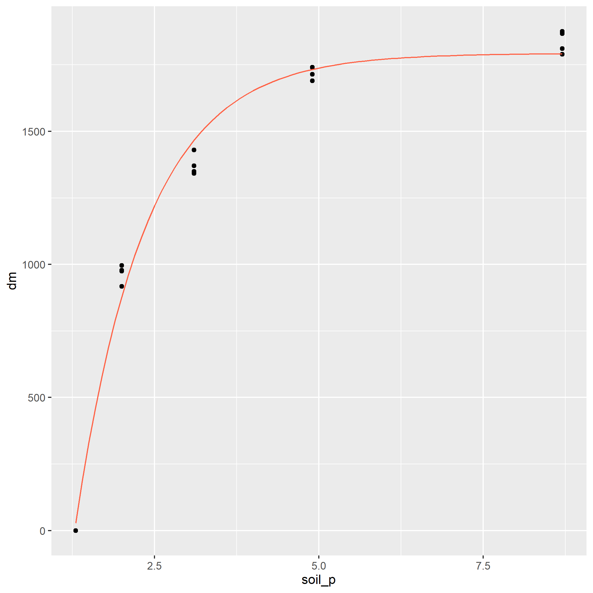
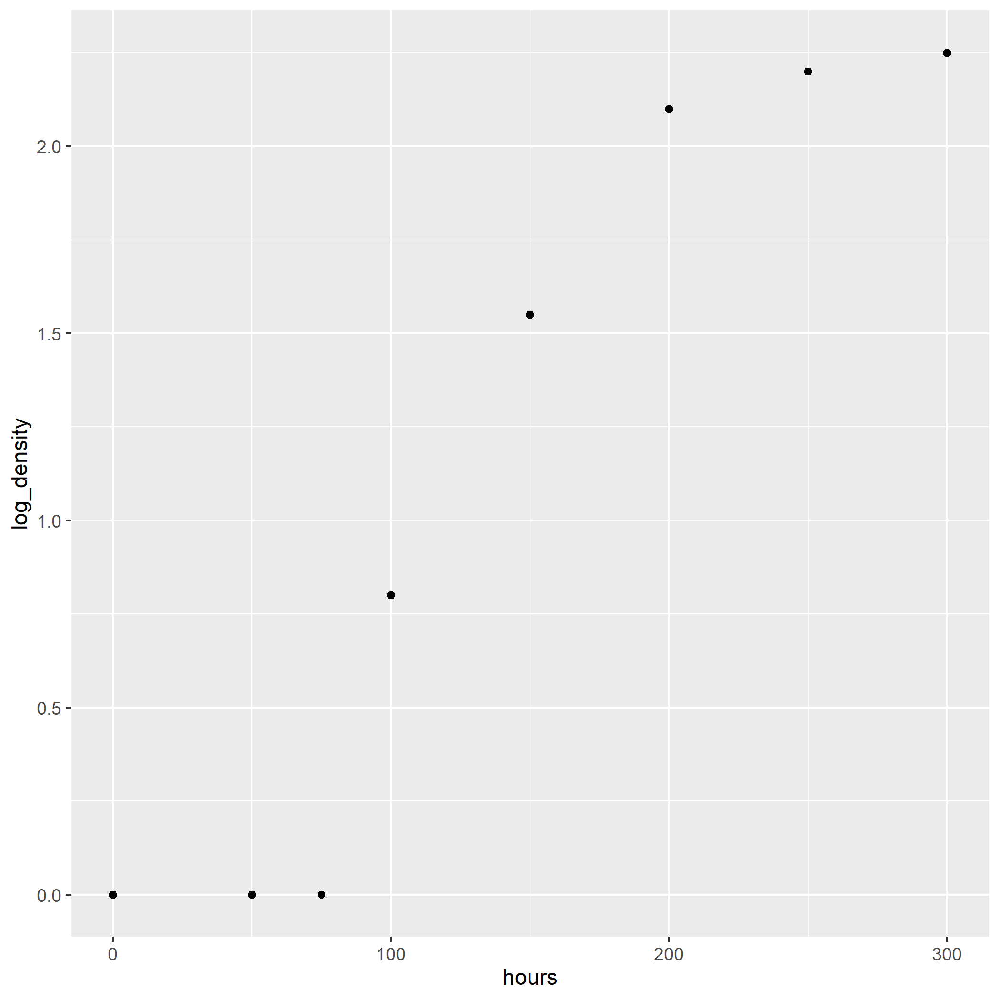

# Introduction
In the other exercises, we focused on multiple linear regression, i.e. using a linear model with multiple predictor variables to explain a complex response.  In this exercise, we will learn to fit data with a nonlinear model.  In our nonlinear model, there is only one predictor variable, but the shape of the model is determined by multiple coefficients, which are fit using nonlinear regression

# Case Study 1: Monomolecular Data
In this example, we will look at the response of corn silage yield to plant population.  We will fit this with a monomolecular, or asymptotic curve.  In this type of curve, the data rise quickly as X increases, but then slope decreases, approaching zero, and the curve plateaus.  This model is often used to fit responses to fertilizer (provided excess rates of the fertilizer are not toxic).  It is also used to describe the yield responses to plant population of many crops, including silage, where crops are grown more for biomass than grain. 


```{r}
library(tidyverse)
silage = read.csv("data/corn_silage_pop_mono.csv")
head(silage)
```

First, let's plot our data.  We are going to take the unusual step of assigning our plot to an r object, p.  This stores all the instructions for making the plot, kind of like we store data in a data.frame.  That way, we can easily add our nonlinear regression line to this plot later.
```{r}
p = silage %>%
  ggplot(aes(x=population, y=yield)) +
  geom_point()

p
```

Now, let's fit our nonlinear model. The next line of code is particularly ugly, but you can largely plug-and-play with it.  

[your object name] = stats::nls([your response variable] ~ SSasymp([your predictor variable],init,m,plateau), data=[your data frame])

Change these items
[your object name]: change to whatever object name you would like.
[your response variable]: change to whatever variable you are measuring the response in.  In this case study, it is yield.
[your predictor variable]: change to whatever variable you are using to predict the response.  In this case study, it is population.
[your data frame]: wherever your data ist stored.  In this case, the silage data frame. 

```{r}
silage_mono = stats::nls(yield ~ SSasymp(population,init,m,plateau), data=silage)

summary(silage_mono)
```

Most of the information in the mode summary can be, for our purposes, ignored.  The important part of this output is the bottom line, "Achieved convergence tolerance".  That means our model successfully fit the data.

We can now create a new data frame with predicted yields for populations from 0 to 10.4.  We are going to start by building a data frame with populations from 0 to 10.4.  We will use the *seq()* command to build our sequence of values for population. 

```{r}
silage_predicted = data.frame(                  # this tells R to create a new data frame called silage_predicted 
  population =                                  # this tells R to create a new column named "n_rate"
    seq(from=0,to=10.4,by=0.1)                  # this creates a sequence of numbers from 0 to 10.4, in increments of 0.1
  )

silage_predicted

```

We see the first 10 rows of our new data frame above.  Our next step is to use the *predict()* to create a new column in our data frame.  This column will have the predicted yield for each value of population.
```{r}
silage_predicted$yield = predict(silage_mono, silage_predicted)

```

Finally, we can add our modelled curve to our initial plot.  This is where we reuse our plot earlier, which we saved as p.  We can now add a new geom to p just like we would to a plot if we were creating it the first time around.

*geom_line()* takes three arguments: the name of the data frame, and aes() argument with the x and y coordinates of the predicted values and, finally, a color argument so that our predicted values are easily distinguished from our observed values.
```{r}
p + 
  geom_line(data = silage_predicted, aes(x=population, y=yield), color="tomato")
```


# Case Study 2: Logistic Data
The logistic curve is often used in agronomy to model the absolute growth of plants over time.  A seedling starts out small -- even if it grows rapidly relative to its initial size, the increments of growth will be small on an absolute scale.  It is the same concept as compound interest.  At first, biomass accumumlation seems small.  After a certain amount of time, however, the seedling establishes a leaf area and root mass that supports rapid, linear growth.  This rapid vegetative growth, however, is followed by a transition to seed production, in which growth slows, and ultimately plateaus as seed fill completes.

```{r}
velvetleaf = read.csv("data/velveleaf_gdd_lai_gomp.csv")
head(velvetleaf)
```

First, let's plot the original data.
```{r}
pV = velvetleaf %>%
  ggplot(aes(x=gdd, y=la)) +
  geom_point()

pV
```

Next, we need to fit our nonlinear function to the data.  Similar to the monomolecular function, this is an ugly model, but all you need to know is how to switch out variables so it can fit your dataset.

[your object name] = stats::nls([your response variable] ~ SSlogis([your predictor variable], Asym, xmid, scal), data=[your data frame])

Change these items
[your object name]: change to whatever object name you would like.
[your response variable]: change to whatever variable you are measuring the response in.  In this case study, it is yield.
[your predictor variable]: change to whatever variable you are using to predict the response.  In this case study, it is population.
[your data frame]: wherever your data ist stored.  In this case, the silage data frame. 

Below, we will plug in our velvetleaf data
```{r}
velvetleaf_log = stats::nls(la ~ SSlogis(gdd, Asym, xmid, scal), data=velvetleaf)

summary(velvetleaf_log)
```

To construct our curve, we again need a dataset with an appropriate sequence of values for gdd.  In this case, we create a range of values from 100 to 600, in increments of 10.
```{r}
velvetleaf_predicted = data.frame(              # this tells R to create a new data frame called velvetleaf_predicted 
  gdd =                                         # this tells R to create a new column named "gdd"
    seq(from=100,to=600,by=10)                  # this creates a sequence of numbers from 100 to 600, in increments of 10
  )

velvetleaf_predicted

```

We use the *predict()* function the same as we did above.
```{r}
velvetleaf_predicted$la = predict(velvetleaf_log, velvetleaf_predicted)

```

Finally, we can add our modelled curve to our initial plot, pv
```{r}
pV + 
  geom_line(data = velvetleaf_predicted, aes(x=gdd, y=la), color="tomato")

```


# Practice 1
In the following study, we will model ryegrass dry matter (dm) response to soil phosphorus test levels.
```{r}
ryegrass = read.csv("data/ryegrass_soil_p_mono.csv")
head(ryegrass)
```

1. Create a scatterplot of the initial ryegrass data.  Assign it to an object (for example, "ryegrass_plot") so you can add the regression line to it later.  
```{r}

```

2. Now fit the monomolecular model to the data.  Print the summary.  You should see an archived convergence tolerance of 2.535e-06.
```{r}

```

3. Next, create a new data frame with soil_p values from 1.3 to 8.7, by 0.1.
```{r}

```

4. Use the *predict()* function to create a new column with the predicted dm for each value of soil_p.
```{r}

```

5. Add the modelled curve to your initial plot.  Your final plot should look like:
```{r}

```



# Practice 2
In this practice, we will fit a logistic curve to the growth of aspergillus, a soil bacteria.

```{r}
aspergillus = read.csv("data/aspergillus_hours_density_logist.csv")
head(aspergillus)
```


1. Plot the original data.
```{r}

```

2. Fit the logistic model to the data.
```{r}

```

3. Create a new dataset with hours from 0 to 300 in increments of 10.
```{r}

```

4. Use the predict() function to predict the values of the logistic growth curve.
```{r}
aspergillus_predicted$log_density = predict(aspergillus_log, aspergillus_predicted)

```

5. Finally, add the modelled curve to the initial plot.  
```{r}

```

Your plot should look like:


